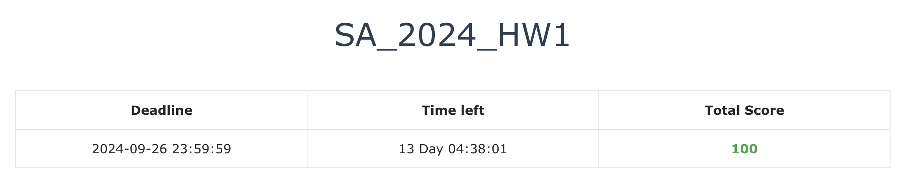

# NYCU-SA
113上 計算機系統管理-蔡孟勳    

**This repo is finished in `Ubuntu 24.04 LTS`**

### HW1 System Setup


### HW2 Shell Script


### HW3 File Server & Backup


### HW4 Web Services & NFS & FireWall


## HW1

> My personal ID : 108

- [x] Your machine should boot using UEFI (5%)
- [x] Set hostname to sa2024-${ID} (5%)
```bash=
hostnamectl set-hostname sa2024-108
```

- [x] Create user (25%)
    - [x] Should be a member of wheel group (or sudo on Ubuntu)
    - [x] Should be able to execute sudo commands without entering password (15%)
    - [x] Should use sh as the default shell (10%)
    - [x] You should use this user instead of root for subsequent operations
    
```bash=
sudo adduser judge
sudo usermod -aG sudo judge

sudo visudo
# add below line into the config file
# judge ALL=(ALL) NOPASSWD: ALL

sudo chsh    -s /bin/sh judge  # Method 1
sudo usermod -s /bin/sh judge  # Method 2

# testing
su - judge
whoami
echo $0
groups judge
```

- [x] Create group (10%)
    - [x] Create a group nycusa (5%)
    - [x] Add judge user to this group (5%)
```bash=
sudo addgroup nycusa
sudo adduser judge nycusa
```

- [x] Set your machine to Taiwan Standard Time (10%)
```bash=
timedatectl
```

- [x] Secure Shell (15%)
    - [x] Enable sshd
    - [x] Install public key to your /home/judge/.ssh for Online Judge
    - [x] Verify the fingerprint of public key
```bash=
sudo systemctl status ssh
# sudo systemctl enable ssh
# sudo systemctl start ssh

wget https://nasa.cs.nycu.edu.tw/sa/2024/nasakey.pub
cat nasakey.pub >> /home/judge/.ssh/authorized_keys

ssh-keygen -l -f ./nasakey.pub
# 256 SHA256:l2xVg+C+hMjMldX6htc4SUPE5taFsxKkevTgiGmpeHA judge@sa-2024 (ED25519)
```

> ```bash=
> sudo vim /etc/ssh/sshd_config
> # passwordAuthentication no
> sudo systemctl restart ssh
> ```

- [x] Edit motd to show “NYCU-SA-2024-${Student ID}” (5%)
```bash=
sudo vim /etc/motd
# NYCU-SA-2024-108
```

- [x] Configure your package manager to use CSIT mirror (10%)
```bash=
# https://it.cs.nycu.edu.tw/equipment-linux-mirror
# https://ubuntu.cs.nycu.edu.tw/ubuntu/

# optional
# sudo cp ubuntu.sources ubuntu.sources.backup

sudo vim /etc/apt/sources.list.d/ubuntu.sources
sudo apt update
sudo apt upgrade
```

- [x] Online Judge servers can ping your system (15%)
```bash=
sudo apt install wireguard
vim /etc/wireguard/wg0.conf
wg-quick up   wg0
wg-quick down wg0

ping -c 3 10.113.108.254
```
